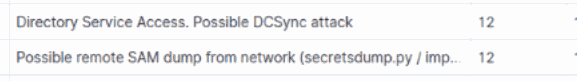
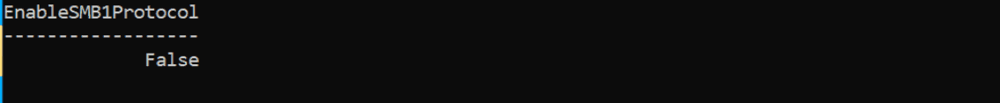
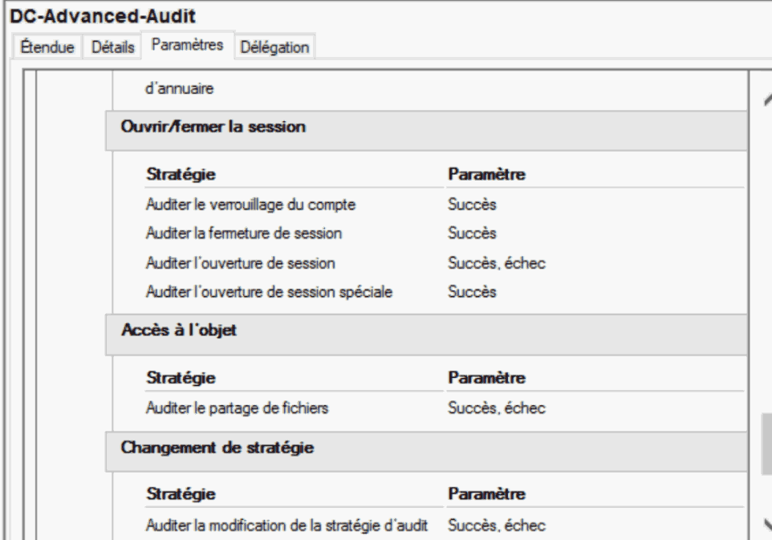
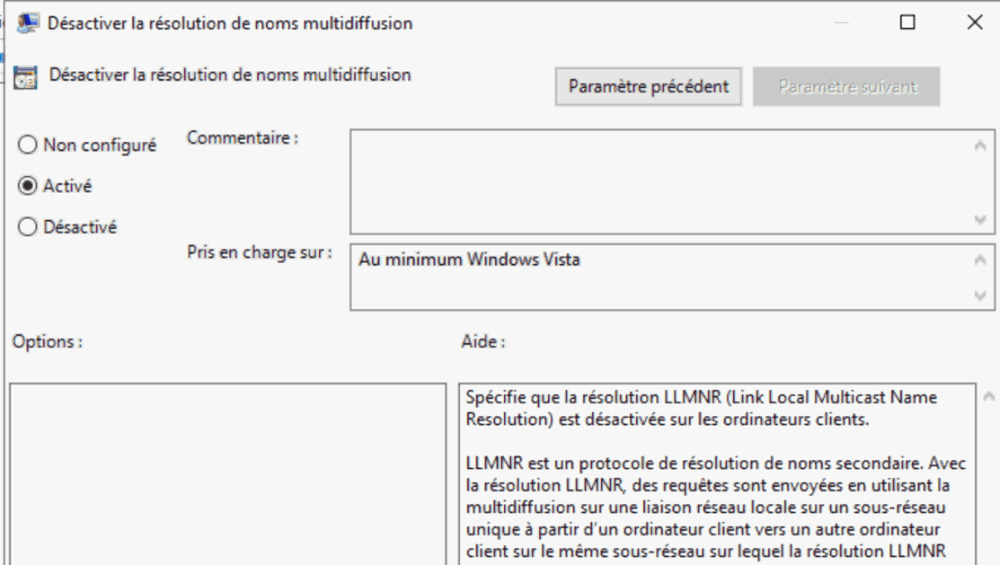
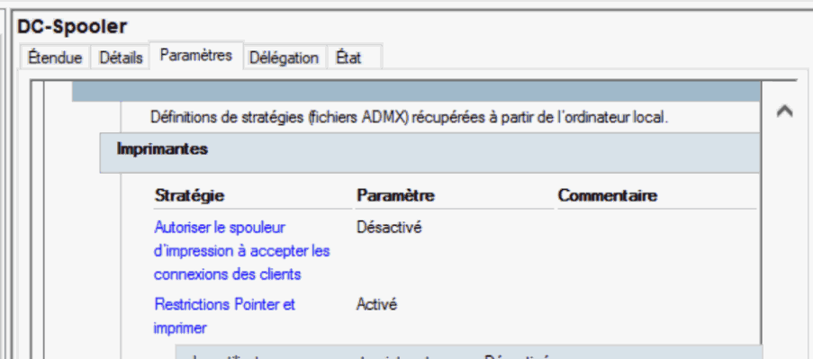

# Méthodologie - audit, supervision et durcissement AD

> Cas de laboratoire réalisé pendant un stage en 2025. Les noms, identifiants et adresses du rapport d'origine ont été retirés. Les captures sont de vrais extraits **recadrés** du rapport ; les commandes administratives reproduites ci-dessous n'incluent aucune valeur propre à l'entreprise. Les résultats concernent la maquette, sans validation en production.

## Fil conducteur

| Action | Pourquoi nous l'avons faite | Ce qu'elle a permis de vérifier |
| --- | --- | --- |
| Construire un domaine de test et auditer avec PingCastle | Reproduire un cas client sans toucher à un annuaire de production | Écarts initiaux et score de risque de la maquette |
| Effectuer des scénarios autorisés et réunir les journaux dans Wazuh | Relier les faiblesses à des activités observables | Alertes sur plusieurs tests, avec limites de couverture |
| Étudier l'impact puis appliquer les corrections | Éviter qu'un durcissement coupe l'authentification, les partages ou les services | État après changement, contrôles fonctionnels et nouvel audit |

## 1. Définir le périmètre et la question à résoudre

**Question :** dans un domaine AD de test qui présente des paramètres peu restrictifs, quels écarts facilitent les abus, quelles traces permettent de les détecter et comment réduire les risques sans casser les usages légitimes ? Le projet simule une situation client dans une maquette isolée. Les scénarios offensifs autorisés servent à vérifier un risque et la visibilité sur celui-ci ; ils ne visent pas un système tiers.

**Livrable :** un parcours « état initial → analyse des usages → tests contrôlés et supervision → analyse d'impact → corrections et contrôles → nouvel audit ». Le rapport de stage original reste privé.

## 2. Étudier les outils avant le déploiement

J'ai comparé les apports de PingCastle, Purple Knight, ADRecon et BloodHound pour l'examen de l'annuaire. PingCastle a été retenu pour obtenir un score de risque et des familles d'écarts exploitables dans la comparaison avant/après. Les autres outils ont été étudiés comme approches complémentaires ; leur mention ne signifie pas qu'ils ont tous été déployés dans le laboratoire.

**Vérification :** premier rapport PingCastle généré et classé par objets obsolètes, comptes privilégiés, anomalies et relations de confiance.

## 3. Construire la maquette virtualisée

Sur Proxmox, nous avons préparé un contrôleur de domaine Windows Server 2022 avec AD DS, DNS et DHCP ; créé des utilisateurs, groupes, permissions et GPO ; puis joint des postes Windows au domaine. Le rapport décrit deux postes Windows 10 et un poste Windows 7, ce dernier permettant d'observer le risque lié à un système hérité. Un poste Kali Linux servait aux tests contrôlés. Une machine Ubuntu hébergeait les composants Wazuh.

**Vérification :** services du domaine accessibles dans la maquette, postes joints et plateforme de supervision opérationnelle. Le schéma représente les rôles sans révéler le plan d'adressage original.

**Pourquoi cette maquette :** les droits, GPO et protocoles hérités peuvent être testés et modifiés sans affecter des utilisateurs réels. Le poste ancien permet d'examiner les dépendances qui rendraient certaines corrections risquées sur un domaine de production.


## 4. Mesurer l'état initial avec PingCastle

J'ai lancé un Health Check sur le domaine simulé et examiné les recommandations plutôt que de m'arrêter au chiffre global. Le score initial était **95/100** (un chiffre élevé indique davantage de risque selon l'outil). Les écarts retenus pour le travail comprenaient notamment des droits trop larges sur des objets ou GPO, des comptes privilégiés mal protégés, SMBv1 ou LM/NTLMv1, des objets anciens, une politique de mots de passe faible, l'absence de LAPS et une politique d'audit insuffisante.

**Livrable :** une liste de corrections priorisées et des vérifications à refaire après chaque famille de changements. Les rapports HTML/XML bruts de PingCastle restent privés.

**Pourquoi lire les familles d'écarts :** le score global classe le risque, mais n'indique pas quelles applications utilisent encore NTLM ou SMBv1 ni quels comptes dépendent d'une délégation. Les décisions de mitigation se prennent à partir des objets et usages concernés.

## 5. Tester les faiblesses pour comprendre leur impact

**Objectif du test d'intrusion :** passer d'une liste de risques PingCastle à des scénarios observables. Dans la maquette, nous avons effectué une reconnaissance des services, des essais sur des mots de passe faibles, une énumération d'objets LDAP/SMB, puis des tests d'accès distant et de privilèges. Le rapport décrit aussi des simulations concernant les identifiants, les hachages et la disponibilité. Le but était de confirmer ce que permettait une mauvaise configuration, d'identifier ses traces, puis de choisir des corrections adaptées.

| Exemple de scénario documenté | Question de sécurité examinée | Ce que nous avons cherché dans la supervision |
| --- | --- | --- |
| Échecs répétés d'authentification | La politique de comptes permet-elle des essais non autorisés ? | Échecs de connexion et alerte correspondante |
| Exécution distante dans la maquette | Que peut faire un compte obtenu sur un poste ou un serveur ? | Processus et activité distante anormale |
| Accès aux données d'identification | Quels risques découlent d'un privilège excessif ? | Accès sensible et alerte de tentative d'extraction |
| Énumération LDAP et activité SMB | Quels objets et partages seraient accessibles ? | Événements LDAP/SMB corrélés au test |

**Périmètre :** comptes et systèmes créés pour le laboratoire. Aucune adresse, commande offensive, valeur de mot de passe ou donnée extraite n'est reproduite dans cette version publique.

## 6. Installer Wazuh pour voir les événements et tester la détection

**Pourquoi Wazuh ?** L'audit de configuration ne garantit pas la détection d'une activité anormale. Le rapport compare Wazuh, Graylog et ELK et retient Wazuh pour réunir collecte des journaux, recherche et règles de sécurité dans un laboratoire. Le choix répond au besoin d'observer ce qui se passe *pendant* les scénarios, puis de vérifier que le durcissement s'accompagne d'une visibilité suffisante.

1. Préparer les certificats pour les composants Wazuh, puis installer et vérifier Indexer, Manager, Filebeat et Dashboard.
2. Enregistrer les agents sur les machines suivies et vérifier leur présence dans le Dashboard.
3. Installer Sysmon sur le serveur Windows et intégrer son journal à la collecte afin de voir davantage d'informations sur les processus et activités système.
4. Préparer des règles adaptées à AD ; le rapport montre notamment des configurations pour DCSync, Kerberoasting et Golden Ticket. Leur configuration **ne prouve pas** à elle seule la détection de tous ces scénarios.
5. Rejouer les scénarios documentés dans la maquette et consulter les événements via **Threat Hunting → Events**. Rapprocher les descriptions et heures d'alerte des tests effectués.

Le rapport présente des alertes observées pour des échecs de connexion répétés, `wmiexec`, une tentative d'extraction d'identifiants, `smbexec` et une énumération LDAP. Des essais `rpcclient` figurent aussi dans les captures du rapport. L'extrait ci-dessous conserve uniquement les descriptions d'alerte ; le nom de l'agent, les adresses et les comptes ont été exclus.



**Vérification et limite :** des alertes existent pour les scénarios ci-dessus, mais le rapport n'établit ni délai moyen de détection, ni couverture exhaustive, ni taux de faux positifs. Il note que le réglage des alertes et la corrélation avancée restent à approfondir.


## 7. Évaluer l'impact avant toute correction

Le risque signalé par PingCastle ne suffit pas à autoriser une modification immédiate. Pour chaque écart : documenter l'état initial, repérer les machines et applications dépendantes, estimer le risque sur l'authentification, l'administration, l'impression ou la journalisation, conserver un moyen de retour arrière quand il est possible, puis vérifier les services après le changement.

| Correction envisagée | Impact possible à vérifier avant application | Approche documentée dans la maquette |
| --- | --- | --- |
| Bloquer LM/NTLMv1 | Une application ou un poste ancien peut perdre l'authentification | Activer l'audit NTLM, examiner les événements et les usages, puis appliquer la stratégie et contrôler les connexions |
| Désactiver SMBv1 | Un partage ou équipement ancien peut devenir inaccessible ; un redémarrage peut être requis | Vérifier l'état, sauvegarder la configuration SMB, désactiver, redémarrer et relire l'état |
| Restreindre les comptes et les GPO | Un service, une tâche planifiée ou une administration déléguée peut perdre ses droits | Examiner membres/ACL et droits attendus avant de retirer une permission ; vérifier ensuite les accès utiles |
| Modifier la politique de mots de passe ou activer Protected Users | Des comptes de service et des systèmes hérités peuvent être affectés | Identifier les comptes concernés et tester les usages avant d'étendre les changements |
| Désactiver le Print Spooler sur un DC | L'impression dépendante de ce service cessera de fonctionner | Vérifier le rôle de la machine et l'usage du service ; contrôler état et GPO après changement |
| Étendre l'audit avancé / activer Sysmon | La quantité de journaux et la charge des hôtes augmentent | Vérifier d'abord les catégories utiles ; le volume et la performance n'ont pas été mesurés dans ce rapport |

Dans le rapport, la sauvegarde est **explicitement documentée pour SMB et des ACL**. Pour d'autres modifications, les vérifications et le retour arrière sont des précautions de méthode à formaliser avant une intervention réelle ; je ne présente pas une sauvegarde complète de chaque GPO comme déjà réalisée.

## 8. Appliquer et vérifier les mitigations

Les corrections ont été effectuées de deux manières, selon le paramètre concerné : commandes PowerShell et consoles graphiques (GPMC, ADUC, stratégie de sécurité locale, Sites et services AD). Les blocs ci-dessous sont des **extraits administratifs du laboratoire**, pas un script à exécuter en bloc sur un domaine d'entreprise. Les noms de machines, utilisateurs et GPO propres au rapport ont été omis.

### 8.1 Protocoles hérités : NTLMv1 et SMBv1

Pour LM/NTLMv1, le rapport commence par activer l'audit via GPO et exporter les événements d'usage pour connaître les dépendances ; ensuite seulement la stratégie impose NTLMv2. Exemple du réglage PowerShell documenté, avec le nom de GPO remplacé :

```powershell
Set-GPRegistryValue -Name '<GPO validée>' `
  -Key 'HKLM\SYSTEM\CurrentControlSet\Control\Lsa' `
  -ValueName 'LmCompatibilityLevel' -Type DWord -Value 5
gpupdate /force
```

Pour SMBv1, le rapport montre le contrôle, la sauvegarde de la configuration, la désactivation, un redémarrage, puis la vérification :

```powershell
Get-SmbServerConfiguration | Select-Object EnableSMB1Protocol
Set-SmbServerConfiguration -EnableSMB1Protocol $false -Force
Disable-WindowsOptionalFeature -Online -FeatureName SMB1Protocol -NoRestart
# Après le redémarrage prévu et les essais de partage :
Get-SmbServerConfiguration | Select-Object EnableSMB1Protocol
```

La sortie conservée montre `False` sur le serveur de la maquette ; elle ne démontre pas à elle seule la compatibilité de toutes les applications.



### 8.2 Comptes, privilèges et délégation

Le rapport inventorie les comptes avec mot de passe n'expirant jamais, retire cette option sur les comptes de test concernés et contrôle à nouveau. Il examine aussi les groupes administratifs, les ACL, la délégation des GPO et certains groupes hérités avant de retirer les droits non justifiés via PowerShell ou ADUC/GPMC. Exemple de **commande de contrôle**, sans liste des comptes :

```powershell
Search-ADAccount -PasswordNeverExpires -UsersOnly |
  Select-Object Name, SamAccountName
```

Dans la maquette, les comptes relevés ont été traités en PowerShell ; sur un vrai domaine, il faudrait exclure ou préparer les comptes de service et vérifier leurs dépendances avant toute modification. Le rapport présente également le déploiement de LAPS, le réglage des droits d'écriture et de lecture et la vérification des autorisations : il ne publie ici aucun mot de passe LAPS.

L'extrait de correction ci-dessous correspond aux **comptes de test examinés** dans le rapport. Il ne doit pas être réutilisé tel quel dans un domaine réel : une sélection non filtrée inclurait potentiellement des comptes de service.

```powershell
Search-ADAccount -PasswordNeverExpires -UsersOnly | ForEach-Object {
  Set-ADUser -Identity $_.SamAccountName -PasswordNeverExpires $false
}
# Refaire la commande de contrôle pour vérifier les comptes encore concernés.
```

### 8.3 GPO, visibilité et services

Par les consoles GPO, nous avons configuré l'audit avancé des DC pour faire remonter des événements utiles à l'investigation, puis vérifié son application. La capture ci-dessous montre des catégories d'audit activées, sans arborescence de domaine ni informations d'entreprise.



La GPO **« Désactiver la résolution de noms multidiffusion »** a été activée pour limiter LLMNR, après examen de la résolution de noms dans la maquette. « Activé » signifie ici que la *désactivation* de LLMNR est activée.



Pour le contrôleur de domaine, nous avons également vérifié l'usage du service d'impression, désactivé les connexions client au spooler dans une GPO dédiée, puis arrêté et désactivé ce service dans le laboratoire avec PowerShell. La capture montre le paramètre GPO ; le rapport vérifie ensuite que le service est arrêté et désactivé.

```powershell
# Sur le DC de laboratoire, après validation de l'absence de besoin d'impression :
Stop-Service Spooler
Set-Service Spooler -StartupType Disabled
Get-Service Spooler | Select-Object Status, StartType
```



Le rapport décrit aussi une politique de mots de passe renforcée, des chemins UNC durcis, une sauvegarde du **System State**, des droits GPO corrigés et des paramètres de protection des comptes. Leur mise en production exigerait la même analyse de dépendances et des essais fonctionnels ; certaines recommandations n'ont pas été intégralement vérifiées hors de la maquette.

| Axe | Actions documentées dans la maquette | Contrôle indiqué dans le rapport |
| --- | --- | --- |
| Protocoles et postes hérités | Audit des dépendances NTLM, désactivation de LM/NTLMv1, SMBv1 et LLMNR ; traitement du poste Windows 7 | Paramètres et état des services vérifiés après application |
| Comptes et privilèges | Revue des groupes administratifs, ACL et droits de modification des GPO ; restriction de la délégation et des comptes autorisés à joindre des postes | Nouvelle lecture des appartenances, ACL et droits GPO |
| Mots de passe et postes | Renforcement des stratégies de comptes et déploiement de LAPS dans la maquette | GPO appliquées et configuration des permissions LAPS contrôlées |
| Visibilité et disponibilité | Audit avancé du contrôleur de domaine, limitation du service d'impression, sauvegarde du System State | Journaux, services et sauvegarde vérifiés dans le laboratoire |

Cette synthèse retient les familles documentées. Une capture montre un paramètre ou une sortie à un instant donné ; elle ne prouve ni le bon fonctionnement de tous les métiers ni un déploiement sur un système réel.

## 9. Refaire l'audit et comparer

Après les corrections, un nouveau Health Check PingCastle a indiqué **20/100** au lieu de **95/100**. Le rapport donne aussi des scores de **20/100** pour les comptes privilégiés et les anomalies de configuration, ce qui rappelle que des écarts restent à traiter. La baisse montre une amélioration mesurée *dans la maquette*, pas une élimination de tous les risques ni un résultat chez un client réel.


## 10. Limites et suites proposées

- La maquette virtualisée ne reproduit pas toutes les dépendances d'une infrastructure de production.
- Le réglage des alertes et la gestion des faux positifs restent à approfondir.
- Aucun indicateur de volume de journaux, de temps de détection ou de charge des hôtes n'a été mesuré.
- Les impacts métiers des changements (authentification, partages, délégation, impression) et le plan de retour arrière doivent être validés avant toute application en entreprise.
- Les extraits de capture publiés ont été recadrés pour masquer les identifiants ; les captures complètes, commandes offensives et rapports bruts restent privés.

**Suite logique :** répéter les audits, tester les règles avec des jeux d'événements contrôlés, mesurer la qualité des alertes et formaliser les procédures de sauvegarde et de retour arrière.
