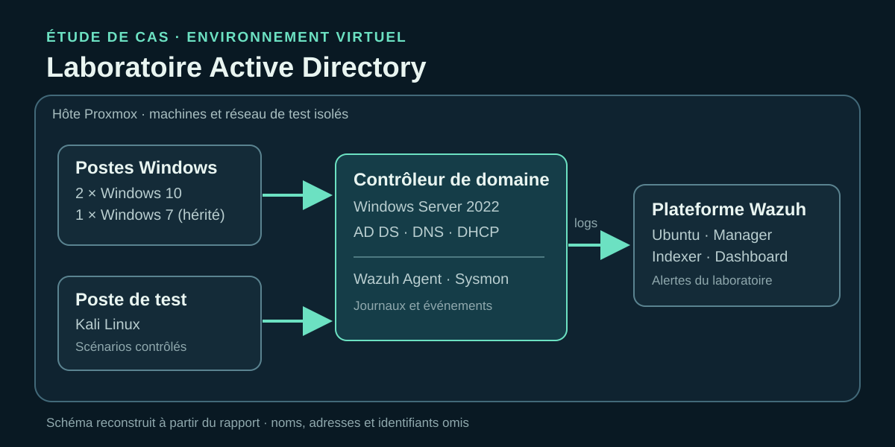
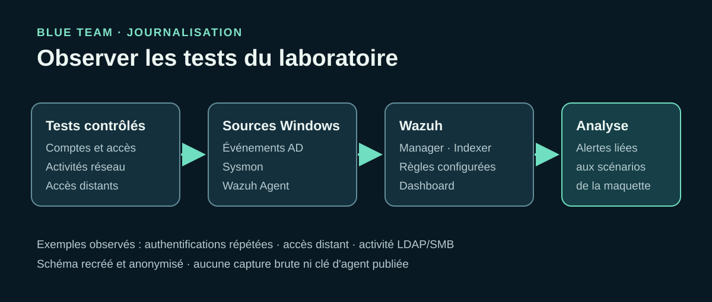
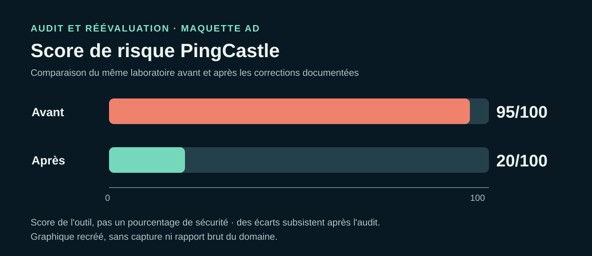

# Méthodologie - audit, supervision et durcissement AD

> Cas de laboratoire réalisé pendant un stage en 2025. Les noms, identifiants et adresses du rapport d'origine ont été retirés. Les étapes ci-dessous décrivent le travail documenté, sans fournir de commandes d'exploitation ni prétendre à une validation en production.

## 1. Définir le périmètre et la question à résoudre

**Question :** dans un domaine AD de test qui présente des paramètres peu restrictifs, quels écarts facilitent les abus et quelles corrections améliorent l'état mesuré par l'audit ? Le projet simule une situation client dans une maquette isolée. Les scénarios offensifs servent uniquement à observer le risque et les traces générées par ce laboratoire.

**Livrable :** un parcours « état initial → tests contrôlés → supervision et corrections → nouvel audit ». Le rapport de stage original reste privé.

## 2. Étudier les outils avant le déploiement

J'ai comparé les apports de PingCastle, Purple Knight, ADRecon et BloodHound pour l'examen de l'annuaire. PingCastle a été retenu pour obtenir un score de risque et des familles d'écarts exploitables dans la comparaison avant/après. Les autres outils ont été étudiés comme approches complémentaires ; leur mention ne signifie pas qu'ils ont tous été déployés dans le laboratoire.

**Vérification :** premier rapport PingCastle généré et classé par objets obsolètes, comptes privilégiés, anomalies et relations de confiance.

## 3. Construire la maquette virtualisée

Sur Proxmox, nous avons préparé un contrôleur de domaine Windows Server 2022 avec AD DS, DNS et DHCP ; créé des utilisateurs, groupes, permissions et GPO ; puis joint des postes Windows au domaine. Le rapport décrit deux postes Windows 10 et un poste Windows 7, ce dernier permettant d'observer le risque lié à un système hérité. Un poste Kali Linux servait aux tests contrôlés. Une machine Ubuntu hébergeait les composants Wazuh.

**Vérification :** services du domaine accessibles dans la maquette, postes joints et plateforme de supervision opérationnelle. Le schéma représente les rôles sans révéler le plan d'adressage original.

## 4. Mesurer l'état initial avec PingCastle

J'ai lancé un Health Check sur le domaine simulé et examiné les recommandations plutôt que de m'arrêter au chiffre global. Le score initial était **95/100** (un chiffre élevé indique davantage de risque selon l'outil). Les écarts retenus pour le travail comprenaient notamment des droits trop larges sur des objets ou GPO, des comptes privilégiés mal protégés, SMBv1 ou LM/NTLMv1, des objets anciens, une politique de mots de passe faible, l'absence de LAPS et une politique d'audit insuffisante.

**Livrable :** une liste de corrections priorisées et des vérifications à refaire après chaque famille de changements. Les rapports HTML/XML bruts de PingCastle restent privés.

## 5. Vérifier les conséquences dans des scénarios contrôlés

Dans la maquette, nous avons effectué une reconnaissance des services, des essais sur des mots de passe faibles, une énumération des objets et partages LDAP/SMB, puis des tests d'accès distant et de privilèges. Le rapport décrit aussi des simulations liées aux hachages et à la disponibilité du domaine. Ces tests ont permis de relier des écarts de configuration à des actions observables sur les machines et dans les journaux.

**Périmètre :** comptes et systèmes créés pour le laboratoire. Aucune adresse, commande offensive, valeur de mot de passe ou donnée extraite n'est reproduite dans cette version publique.

## 6. Centraliser et tester la détection

Nous avons installé Wazuh Manager, Indexer et Dashboard, inscrit les agents des machines surveillées, puis ajouté Sysmon au serveur Windows pour enrichir la télémétrie. Des règles Wazuh adaptées au projet ont été définies. Les tests documentés montrent des alertes pour des tentatives d'authentification répétées, l'exécution distante, des activités liées aux identifiants, l'énumération LDAP et l'activité SMB.

**Vérification :** consultation des événements dans Wazuh et rapprochement avec les scénarios simulés. Le rapport n'établit ni délai moyen de détection, ni taux de couverture, ni taux de faux positifs. La présence d'une règle configurée ne prouve pas à elle seule que chaque technique a été détectée.

## 7. Appliquer les mesures de durcissement

Avant les modifications sensibles, nous avons documenté et sauvegardé les configurations nécessaires au retour arrière. Les corrections décrites dans le rapport se regroupent ainsi :

| Axe | Actions dans la maquette | Contrôle effectué |
| --- | --- | --- |
| Protocoles et postes hérités | Audit des dépendances NTLM, désactivation de LM/NTLMv1, SMBv1 et LLMNR ; traitement du poste Windows 7 | Paramètres et état des services vérifiés après application |
| Comptes et privilèges | Revue des groupes administratifs, ACL et droits de modification des GPO ; restriction de la délégation et des comptes autorisés à joindre des postes | Nouvelle lecture des appartenances, ACL et droits GPO |
| Mots de passe et postes | Renforcement des stratégies de comptes et déploiement de LAPS dans la maquette | GPO appliquées et configuration des permissions LAPS contrôlées |
| Visibilité et disponibilité | Audit avancé du contrôleur de domaine, limitation du service d'impression, sauvegarde du System State | Journaux, services et sauvegarde vérifiés dans le laboratoire |

Le rapport documente d'autres ajustements (par exemple les chemins UNC et certains groupes hérités). Cette synthèse retient les familles les mieux étayées et évite de transformer chaque recommandation en promesse de déploiement sur un système réel.

## 8. Refaire l'audit et comparer

Après les corrections, un nouveau Health Check PingCastle a indiqué **20/100** au lieu de **95/100**. Le rapport donne aussi des scores de **20/100** pour les comptes privilégiés et les anomalies de configuration, ce qui rappelle que des écarts restent à traiter. La baisse montre une amélioration mesurée *dans la maquette*, pas une élimination de tous les risques ni un résultat chez un client réel.

## 9. Limites et suites proposées

- La maquette virtualisée ne reproduit pas toutes les dépendances d'une infrastructure de production.
- Le réglage des alertes et la gestion des faux positifs restent à approfondir.
- Aucun indicateur de volume de journaux, de temps de détection ou de charge des hôtes n'a été mesuré.
- Certaines recommandations demandent une validation de compatibilité et une planification avant toute application en entreprise.

**Suite logique :** répéter les audits, tester les règles avec des jeux d'événements contrôlés, mesurer la qualité des alertes et formaliser les procédures de sauvegarde et de retour arrière.
