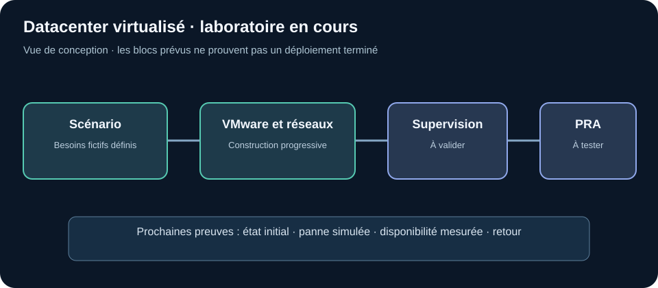

# Datacenter virtualisé — laboratoire en cours

**Projet personnel sur VMware Workstation Pro.** Je construis une maquette d'entreprise fictive pour comprendre les dépendances entre réseaux, machines et services avant de tester la disponibilité et la reprise.

## But du projet

Concevoir une infrastructure virtualisée segmentée, repérer ses points uniques de panne et préparer des essais de coupure et de restauration. Le mot « haute disponibilité » désigne ici **l'objectif à vérifier**, pas un résultat déjà acquis.

## Problématique

Si un hôte, un réseau virtuel ou un service central tombe, quelles fonctions cessent de marcher ? Une architecture peut sembler redondante sur un schéma alors qu'un seul composant bloque encore tout le système. Il faut connaître ces dépendances avant de promettre une bascule ou un plan de reprise d'activité (PRA).

## Travail réalisé et prochaines étapes

| Déjà décrit ou engagé | Pourquoi | État de vérification |
| --- | --- | --- |
| Scénario d'entreprise fictive et premiers schémas | Définir les services, les zones et leurs dépendances | Conception en cours |
| Préparation progressive des VMs et réseaux dans VMware Workstation Pro | Construire l'environnement nécessaire aux essais | Montage en cours ; architecture complète non démontrée |
| Scénarios de panne et de reprise envisagés | Savoir quoi mesurer quand les composants seront prêts | Pas de test final de bascule ou de PRA publié |

## Résultat et limites

Le cas d'usage, les premiers choix de segmentation et le **plan de validation** sont définis. Aucun temps de bascule, résultat de reprise ou niveau de disponibilité mesuré n'est présenté : les preuves seront ajoutées après les essais. Ce laboratoire ne constitue pas une infrastructure de production.

[Lire la méthodologie : construction et tests prévus](METHODOLOGIE.md).
