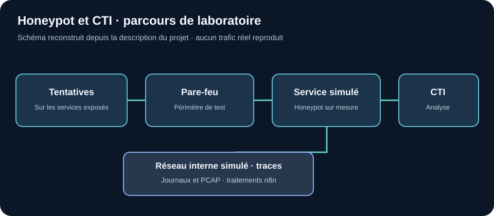

# Honeypot sur mesure et interface CTI

**Projet de fin d'études réalisé en équipe (2026).** Cette fiche publique reprend les objectifs et travaux décrits par Ihssane Zaoui ; le code, les données d'attaque et le rapport technique de l'entreprise ne sont pas publiés dans les dépôts GitHub actuellement accessibles.

## Problématique

Nous voulions observer les attaques visant des services proches de ceux d'une entreprise dans un contexte marocain : quelles étapes suit un attaquant après un premier contact, quels services attirent des tentatives et combien de temps après une CVE connue apparaît la première tentative *visible dans notre dispositif* ? L'évaluation initiale de T-Pot et de ses capteurs ne couvrait pas suffisamment les services et le parcours que nous voulions simuler.

## Travail décrit

| Étape | Choix et réalisation | But |
| --- | --- | --- |
| État de l'art | Étude des honeypots, essai de T-Pot/Cowrie et analyse de leurs limites pour le cas d'usage | Fixer des besoins précis avant d'étendre la maquette |
| Observation | Conception d'un honeypot développé pour représenter un service client simulé | Recueillir des interactions adaptées au scénario étudié |
| Architecture | Pare-feu en amont et réseau interne simulé derrière les services exposés | Observer le parcours après une première interaction dans un cadre contrôlé |
| Analyse | Trafic, PCAP et journaux rapprochés dans une interface CTI | Examiner les tentatives, le contexte CVE et la séquence d'événements |
| Traitements | Automatisation de tâches de collecte/analyse avec n8n | Réduire les opérations manuelles répétitives |

## Résultat et limites

La maquette et l'interface ont été conçues pour réunir les événements des services simulés et étudier les séquences d'attaque. **Aucun volume de captures, délai CVE moyen, taux de couverture ou résultat représentatif de tout le Maroc n'est publié ici** : ces chiffres exigeraient les jeux de données et mesures du projet, absents des dépôts accessibles. Une attaque qui n'a pas été vue par les capteurs ne signifie pas qu'elle n'a pas eu lieu ailleurs.

[Lire la méthodologie et les limites](METHODOLOGIE.md).
